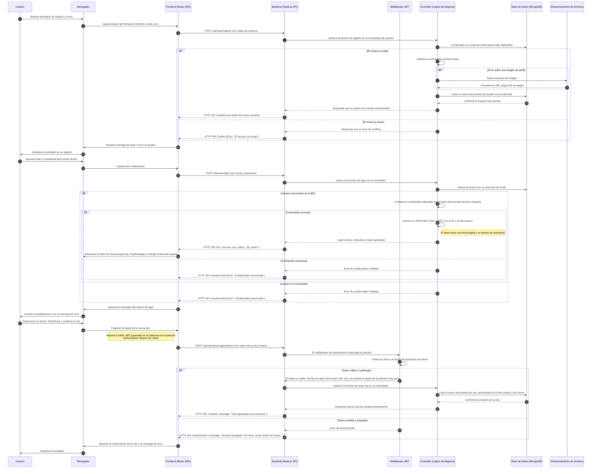
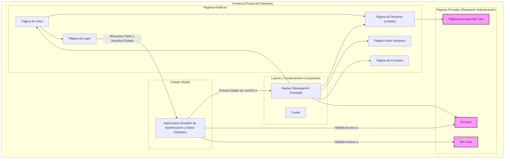
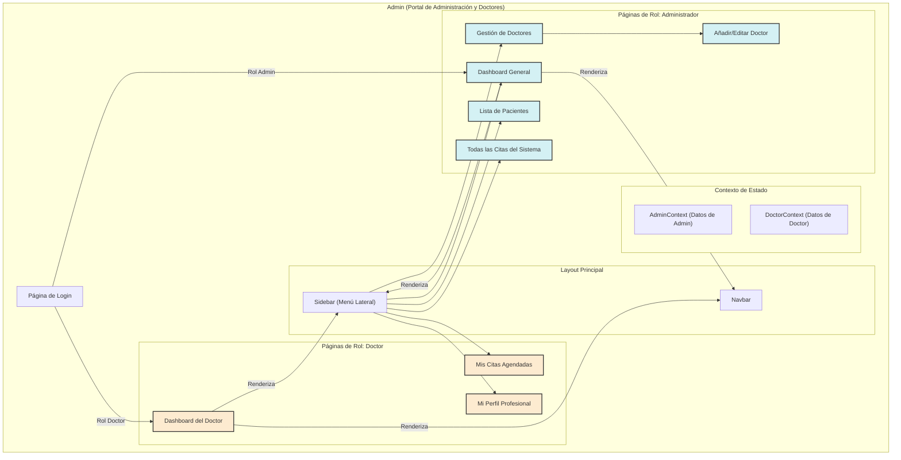
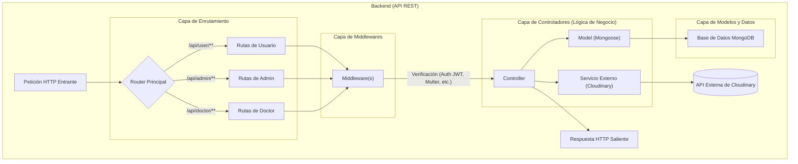

# Diagrama de Flujo y Arquitectura Detallada: Medisalud

Este documento contiene un diagrama de secuencia que detalla el funcionamiento interno y las interacciones entre los componentes de la arquitectura de Medisalud para diferentes flujos de usuario.

## Diagrama de Secuencia

---

## Diagramas de Arquitectura de Componentes

A continuación se presentan los diagramas de flujo que describen la arquitectura interna de cada uno de los tres componentes principales de Medisalud.

### 1. Arquitectura del Frontend (Portal del Paciente)

Este diagrama muestra la relación entre las páginas, los componentes principales y el contexto de estado en la aplicación React del cliente.

### 2. Arquitectura del Admin (Portal de Administración)

Este diagrama ilustra la estructura del panel de administración, utilizado tanto por administradores como por doctores, mostrando sus diferentes secciones y componentes.

### 3. Arquitectura del Backend (API REST)

Este diagrama de flujo muestra el ciclo de vida de una petición HTTP a través de las diferentes capas de la API del backend.

